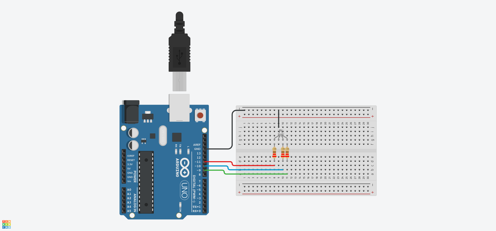

# Projeto Arduíno para manipular um led RGB

## Contextualização

Neste experimento fiz com que o arduíno manipulasse um led RGB 

## Lista de componentes:

- Arduíno UNO R3
- Um cabo de conexão USB
- Placa de prototipação (Protoboard)
- LED RGB Cátodo
- Resistor de 220 Ω ohms
- Jumpers (macho-macho)

## Esquema do projeto

## Projeto no Tinkercad

https://www.tinkercad.com/things/by2bXjDt83A
